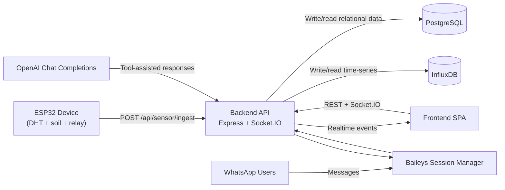

# Smart Irrigation Repository Architecture

## 1. Purpose and Scope
This repository implements a full smart-irrigation stack:
- **Firmware (`firmware/`)** running on ESP32 devices to read sensors, drive a relay (pump), and poll cloud commands.
- **Backend (`backend/`)** as the operational control plane and data API.
- **Frontend (`frontend/`)** for admins/operators to manage farms, users, devices, and WhatsApp connectivity.

Core concerns:
- Telemetry ingestion and historical querying
- Irrigation command orchestration
- Farm/user/device management
- WhatsApp-based interaction and notifications
- AI-assisted farm interaction over messaging

## 2. Repository Layout
- `backend/`: Node.js + Express API, Socket.IO server, Sequelize models, InfluxDB integrations, WhatsApp session manager.
- `frontend/`: Vite + React SPA for operational management.
- `firmware/main/main.ino`: ESP32 control loop and cloud integration.
- `docker-compose.yml`: Local Postgres + InfluxDB infrastructure.
- `public/`: built frontend assets served by backend in production-style runtime.

## 3. High-Level System Context

## 4. Backend Architecture

### 4.1 Runtime Composition
- Entrypoint: `backend/index.js`
- HTTP app: `backend/app.js`
- Server behavior:
  - loads env and starts Express
  - runs `sequelize.sync()` for relational schema
  - attaches Socket.IO
  - initializes WhatsApp sessions for all farms (`whatsappService.initAll()`)
  - graceful shutdown flushes/closes Influx write API

### 4.2 Layering and Responsibilities
- **Routes (`backend/routes`)**: endpoint mapping and middleware attachment.
- **Controllers (`backend/controllers`)**: request handling and response shaping.
- **Services (`backend/services`)**: domain logic and external system interactions.
- **Models (`backend/models`)**: relational schema + associations (Sequelize).
- **Middleware (`backend/middleware`)**: auth, validation, rate limit, error handler.
- **Config (`backend/config`)**: env schema validation and Influx client setup.

### 4.3 Key Backend Domains
- **Auth**: `POST /api/auth/login`, `POST /api/auth/logout`.
- **Farms**: CRUD + farm context/alerts endpoints.
- **Devices**: CRUD + reading history + irrigation command endpoints.
- **Sensor ingestion**: `POST /api/sensor/ingest` (single or batch payload).
- **Irrigation logs**: write/query irrigation events by farm.
- **AI query**: `POST /api/ai/query` with rate limiting and Zod validation.
- **WhatsApp**: status/send/logout/reconnect APIs and socket event propagation.

### 4.4 Data Persistence Strategy
- **PostgreSQL (system-of-record for entities and command state)**
  - Users, Farms, Devices
  - farm-device mapping
  - device readings snapshot table (`device_readings`)
  - irrigation status summary (`device_irrigation_status`)
  - queued device commands (`device_commands`)
- **InfluxDB (time-series and alert/event history)**
  - sensor/device telemetry points
  - irrigation log points
  - active alert stream

### 4.5 Core Data Model (Relational)
- `Farm` 1:N `User`
- `Farm` M:N `Device` via `FarmDevice`
- `Device` 1:N `DeviceReading`
- `Device` 1:1 `DeviceIrrigationStatus`
- `Device` 1:N `DeviceCommand`

### 4.6 Real-Time and Async Behavior
- **Socket.IO events**
  - `farm_updated`
  - `whatsapp_status`
  - `whatsapp_qr`
- **Command queue pattern**
  - UI/WhatsApp action writes `DeviceCommand` rows (`PENDING`)
  - device polls `/api/sensor/ingest`
  - backend returns pending commands in ingest response and marks them `SENT`

## 5. Frontend Architecture
- Framework: React 19 + React Router + Axios + Socket.IO client.
- Entrypoints: `frontend/src/main.jsx`, `frontend/src/App.jsx`.
- Main pages:
  - `Login`
  - `Home` (tabbed dashboard)
  - `Settings`
  - `AdminOnboarding`
- Core modules:
  - `FarmSelector` subscribes to `farm_updated` socket events.
  - `PlatformSettings` subscribes to WhatsApp status/QR socket events.
  - `DeviceList` handles irrigation actions and device telemetry modal.
  - `UserList`/`FarmList` provide management CRUD flows.
- Auth model: browser `localStorage` token + client-side route guard (`ProtectedRoute`).

## 6. Firmware Architecture (ESP32)
File: `firmware/main/main.ino`

Main loop behavior:
1. Read DHT + soil moisture values.
2. Compute irrigation state from:
   - auto mode (`soilPercent < 25`) and
   - active manual override window (`manualIrrigationEnd`).
3. Apply relay output.
4. Emit SMS on pump state transitions.
5. Every interval:
   - POST telemetry to `/api/sensor/ingest`
   - parse returned `commands[]`
   - execute `START_IRRIGATION`/`STOP_IRRIGATION` commands.

Fallback strategy:
- If Wi-Fi/cloud unavailable, firmware uses GSM SMS status/alerts.

## 7. End-to-End Runtime Flows

### 7.1 Telemetry + Command Polling
1. Device sends sensor payload to `/api/sensor/ingest`.
2. Backend persists reading (Postgres + Influx), evaluates thresholds, stores alerts.
3. Backend loads pending `DeviceCommand` rows.
4. Backend responds with `commands` array.
5. Device executes commands and updates local irrigation state.

### 7.2 Dashboard-Driven Irrigation
1. User triggers start/stop from frontend (`/api/devices/:id/start-irrigation` or `/stop-irrigation`).
2. Backend queues `DeviceCommand` and updates irrigation summary table.
3. Device picks command on next ingest poll.

### 7.3 WhatsApp Session Lifecycle
1. Backend initializes Baileys per farm at startup.
2. QR and connection changes are persisted to farm state and emitted via Socket.IO.
3. Incoming WhatsApp messages are farm-access checked against users.
4. Command-like messages can queue irrigation directly; other prompts go through AI service.

## 8. Deployment and Environment
- Backend requires Node 20+ and validated env config (`backend/config/env.js`).
- Required external services:
  - PostgreSQL
  - InfluxDB 2.x
  - Optional OpenAI API key for AI features
- Local infra bootstrap via `docker-compose.yml` (Postgres + InfluxDB).
- Backend serves static files from `/public` and falls back to `public/index.html` for SPA routes.

## 9. Observability and Operations
- Request and error logging via Winston + express-winston.
- Health probes:
  - `GET /health/live`
  - `GET /health/ready`
- In-memory rate limiter used for AI query endpoint.

## 10. Known Architecture Gaps / Risks
Current codebase has a few mismatches that affect architectural correctness:
- **Measurement name inconsistency**:
  - writers use `device_readings` in several services,
  - farm analytics queries filter `sensor_readings`.
  - Impact: farm context/history queries may miss ingested data.
- **AI controller/service mismatch**:
  - controller calls `aiService.answerInfluxQuestion(...)`,
  - exported AI service currently exposes `generateResponse(...)`.
  - Impact: `/api/ai/query` is likely broken at runtime.
- **Frontend/admin route mismatch**:
  - frontend calls `/api/admin/info` and `/api/admin/setup`,
  - backend has no matching admin route handlers (only a generic `/api/admin` guard).
- **Auth model is placeholder-grade**:
  - token is base64 username+timestamp (no signature/expiry verification).
- **Route protection inconsistency**:
  - many management endpoints are callable without auth middleware.
- **Schema evolution**:
  - database relies on `sequelize.sync()` at boot; no migration strategy is present.

## 11. Suggested Next Architecture Iterations
1. Unify telemetry measurement schema and querying conventions (`device_id` vs `sensor_id`, measurement names).
2. Align AI endpoint contract (`queryTimeSeries` controller and AI service API).
3. Implement concrete authN/authZ (JWT + role checks on management routes).
4. Add explicit DB migrations and environment-specific rollout process.
5. Introduce per-farm/per-device command acknowledgement lifecycle (`SENT` -> `EXECUTED`/`FAILED`).
6. Split WhatsApp session subsystem into isolated module with retry/backoff policy and persistence boundaries.
